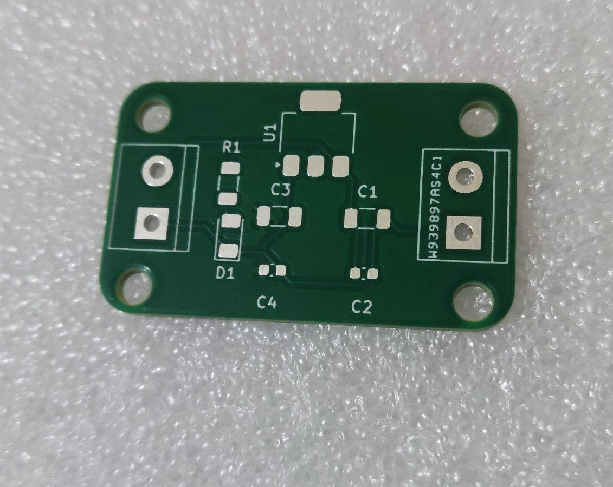

📦 Repository Contents
Regulator.kicad_sch – KiCad schematic
Regulator.kicad_pcb – KiCad PCB layout
 

## Sponsored by PCBWay
This project sponsored by [PCBWay](https://www.pcbway.com), who supported the prototyping of this board.  
Special thanks to Liam from PCBWay’s marketing team for facilitating the collaboration.

## 🖼️ Previews

### Schematic

### PCB
  
  
  

### photos of the bare PCBs

**⚙️ Typical Specs (AMS1117-3.3 based) :**

Output: 3.3 V fixed

Input: (commonly) ≥ 4.5 V up to around 12 V (observe power dissipation!)

Dropout: ~1.1–1.3 V (load-dependent)

Max current: up to 1 A electrically, but thermally limited by SOT-223 and copper area

Thermal tip: Keep large copper under/around the tab (pin 2) for heat spreading; derate current for higher VIN–VOUT.

 
 

**🧠 How the Circuit Works :**

Input (J1) receives unregulated DC.

C1/C2 provide input bulk and high-frequency decoupling close to U1.IN.

U1 (AMS1117-3.3) regulates to 3.3 V at U1.OUT.

C3/C4 provide output bulk and HF bypass close to U1.OUT for stability and transient response.

LED D1 + R1 connect to the 3.3 V output as a power-good indicator.

Output (J2) provides the regulated 3.3 V and GND to your load.

 
 

**✨ Author:**

Awab — @AWABEEE
